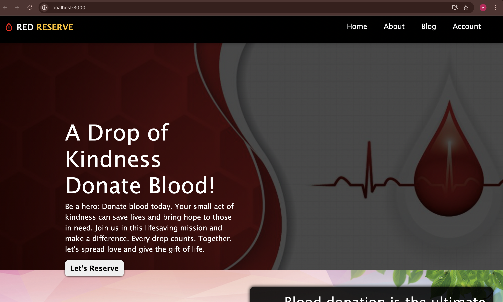
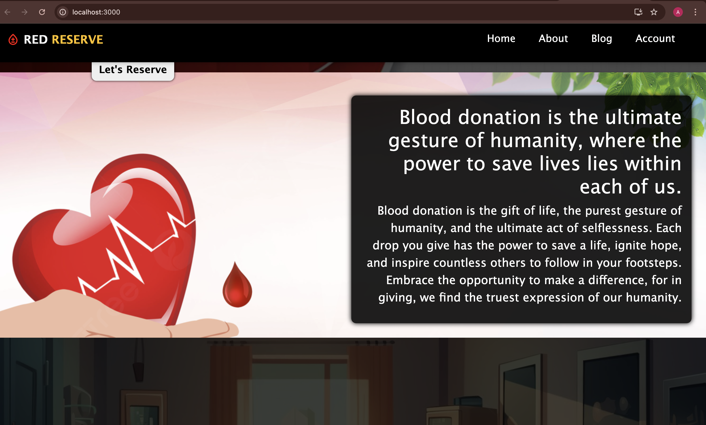
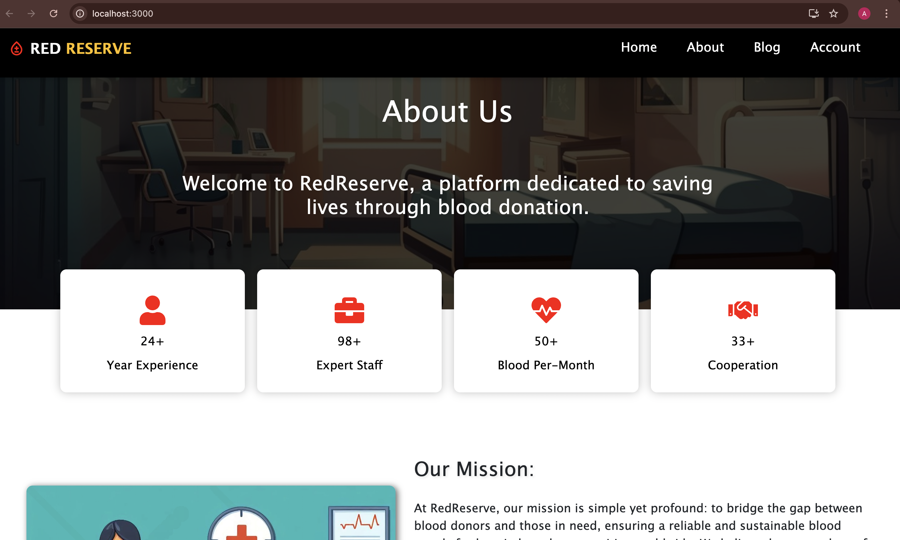
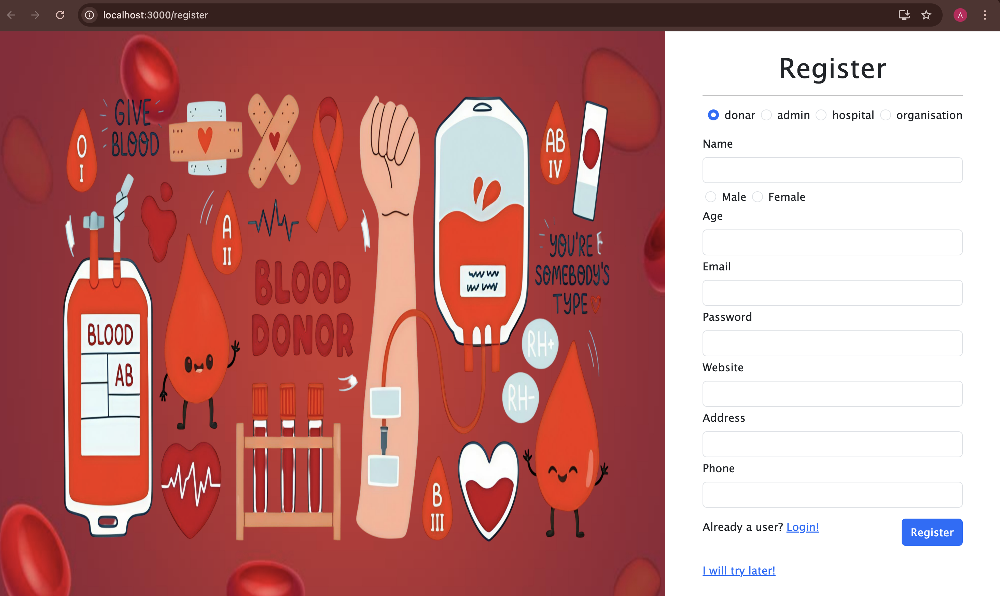
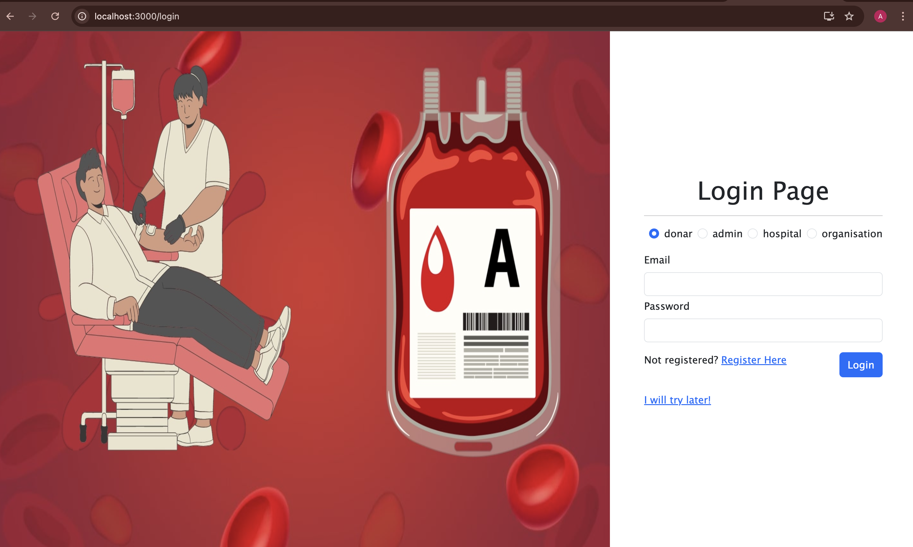
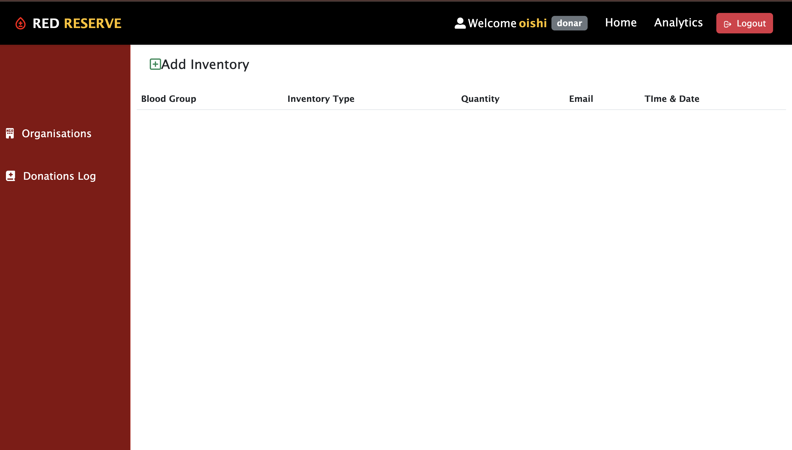
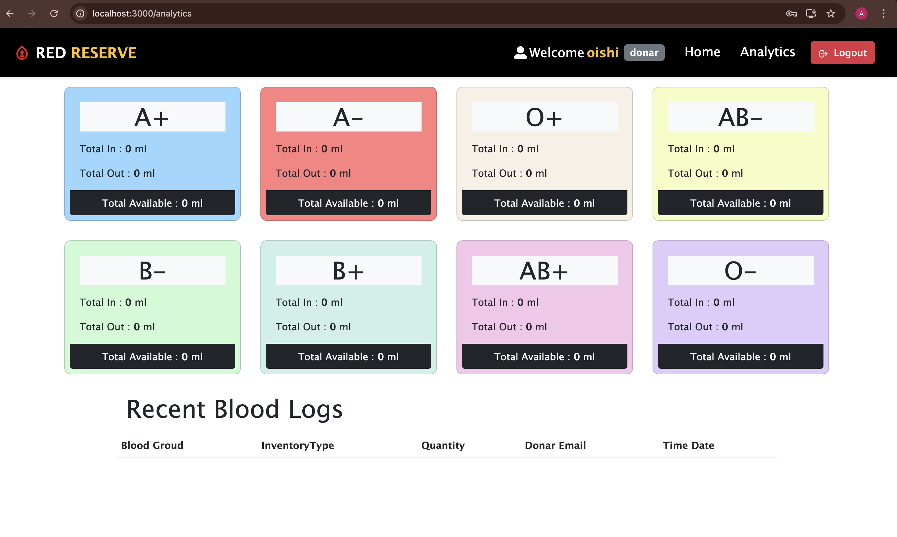
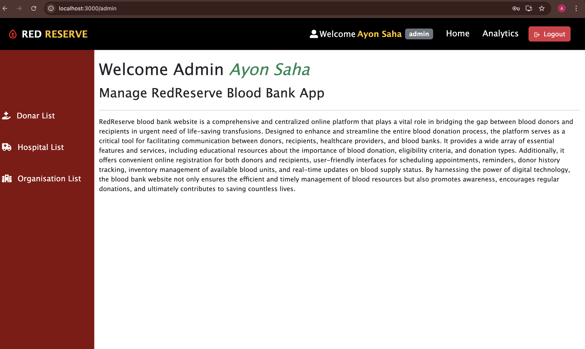
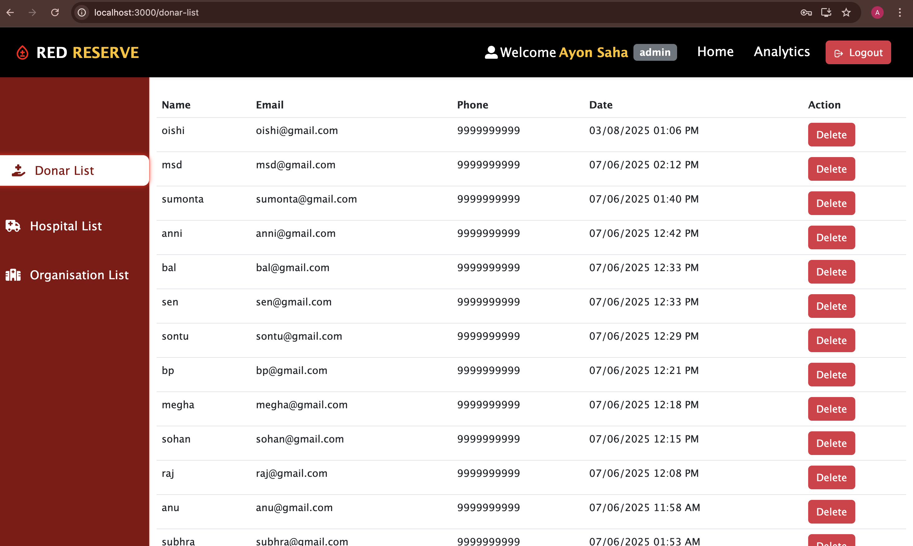
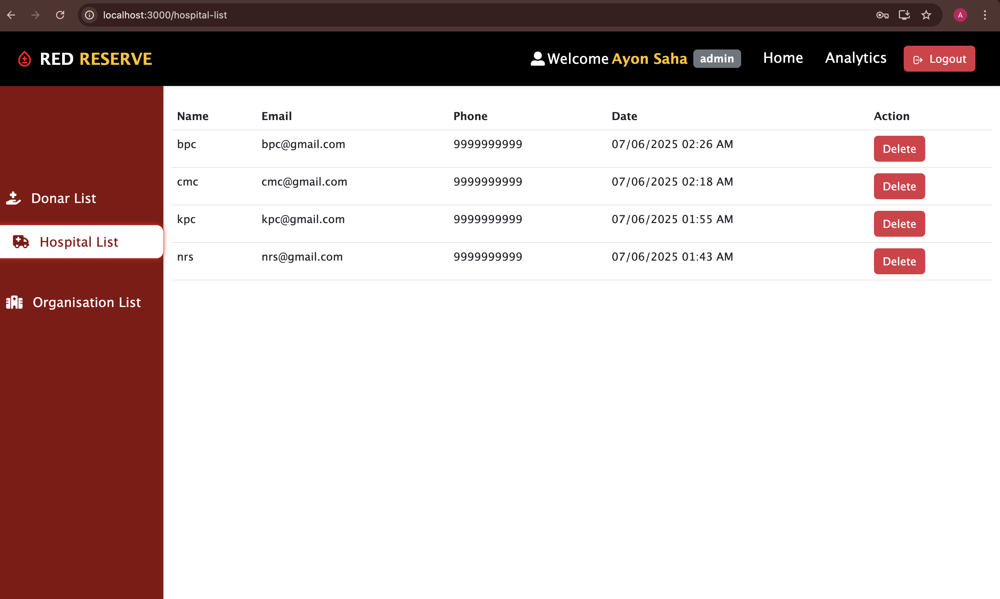

# Red Reserve - Blood Bank Management Application

A full-stack web application designed to streamline blood donation processes, facilitate coordination between donors, hospitals, blood banks, and organizations, and enable real-time blood stock management.

---

## Table of Contents
- [Project Overview](#project-overview)
- [Features](#features)
- [Technologies Used](#technologies-used)
- [Project Architecture](#project-architecture)
- [Database Structure](#database-structure)
- [Screenshots](#screenshots)
- [Project Modules](#project-modules)
- [Usage](#usage)
- [Benefits](#benefits)
- [Future Improvements](#future-improvements)

---

## Project Overview
**Red Reserve** is a comprehensive Blood Bank Management Application designed to streamline and enhance the process of blood donation, tracking, and inventory management. This platform connects donors, hospitals, organizations, and admins to ensure smooth blood donation processes, efficient blood stock management, and quicker response times during emergencies.

The primary goal of **Red Reserve** is to simplify the coordination between blood donors, hospitals, and blood banks, and to provide a real-time solution for tracking blood stock availability. By managing blood donation events, user registrations, blood requests, and blood stock, Red Reserve ensures that hospitals and organizations have easy access to the blood supply when needed most.

---

## Features
- **Real-time Blood Stock Management**  
  Blood banks and hospitals can instantly update and monitor the availability of different blood types in real-time, ensuring visibility across the system.

- **Multiple User Roles**
  - **Donors**: Register, manage donation history, and discover donation events near them.  
  - **Hospitals**: Check available blood stocks, place requests, and track delivery.  
  - **Organizations**: Organize and manage blood donation camps.  
  - **Admin**: Full control over all functionalities, including managing users, blood stocks, and logs.

- **Secure User Registration and Authentication**  
  With JWT-based authentication, only authorized individuals can access sensitive data.

- **Event Management**  
  Organizations can create donation events, allowing donors to register directly.

- **Hospital Blood Requests**  
  Hospitals can quickly request required blood types, ensuring fast and efficient supply.

- **Admin Dashboard**  
  Provides a centralized interface for managing users, stocks, and events.

---

## Problem Solved
The blood donation process in many regions remains inefficient due to poor coordination. This often causes:
- Delays in obtaining blood during emergencies.
- Inefficient tracking of blood stocks.
- Limited communication between donors, hospitals, and organizations.

**Red Reserve** solves these issues by:
- Providing a centralized, real-time platform.
- Streamlining stock updates and blood requests.
- Facilitating better coordination across stakeholders.

---

## How the Application Works
- **Donor**: Registers, views history, and joins donation events.  
- **Hospital**: Logs in, checks available stocks, and places requests.  
- **Organization**: Creates events, inviting donors to participate.  
- **Admin**: Monitors and manages the entire system.  

---

## Technologies Used
- **Frontend**: React.js  
- **Backend**: Node.js, Express.js  
- **Database**: MongoDB  
- **Authentication**: JSON Web Tokens (JWT)  
- **Real-Time Updates**: WebSocket  

---

## Project Architecture
**MERN Stack**:  
- **Client-Side (React)**: User interaction and API calls.  
- **Server-Side (Express & Node.js)**: Handles business logic and database queries.  
- **Database (MongoDB)**: Stores users, inventory, and events data.  

---

## Screenshots

### Homepage

### Homepage

### Homepage-about

### Registration

### Login

### Donor Home

### Donor Analytics

### Admin Home

### Blood Stock Management

### Hospital List

---

## Database Structure
- **Users**: Stores all roles (Donor, Hospital, Organization, Admin) with role, name, email, phone, etc.  
- **Inventories**: Tracks blood stock by type, quantity, and location.  

---

## Project Modules
- **User Management**: Role-based login and secure access.  
- **Blood Stock Management**: Real-time stock updates.  
- **Hospital Requests**: Place and manage blood requests.  
- **Event Management**: Create and join donation events.  
- **Admin Dashboard**: Centralized system monitoring and control.  

---

## Usage
- **Donor**: Register, view donation history, join events.  
- **Hospital**: Check blood availability and place requests.  
- **Organization**: Organize and manage donation events.  
- **Admin**: Manage users, stocks, and system operations.  

---

## Benefits
- **Improved Coordination**: Real-time stock tracking.  
- **Increased Donor Engagement**: Event participation and donation history tracking.  
- **Scalable Platform**: Can expand across multiple regions.  
- **Efficient Resource Management**: Hospitals and blood banks remain prepared during emergencies.  

---

## Future Improvements
- **Mobile Application**: For easier accessibility.  
- **Notification System**: Real-time alerts for donors and hospitals.  
- **Data Analytics**: For donation trends and stock insights.  

---

## About
**Red Reserve** is a complete MERN stack blood bank management system designed to improve efficiency, transparency, and accessibility in blood donation.  

---
